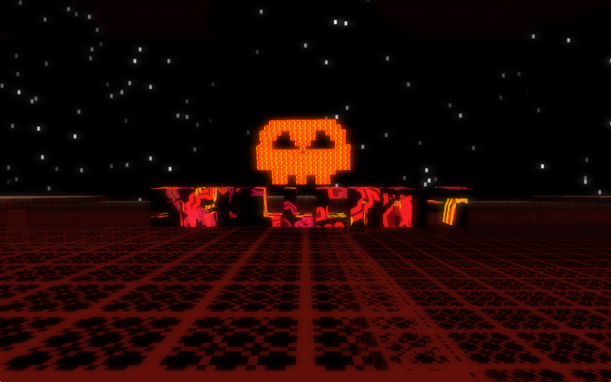
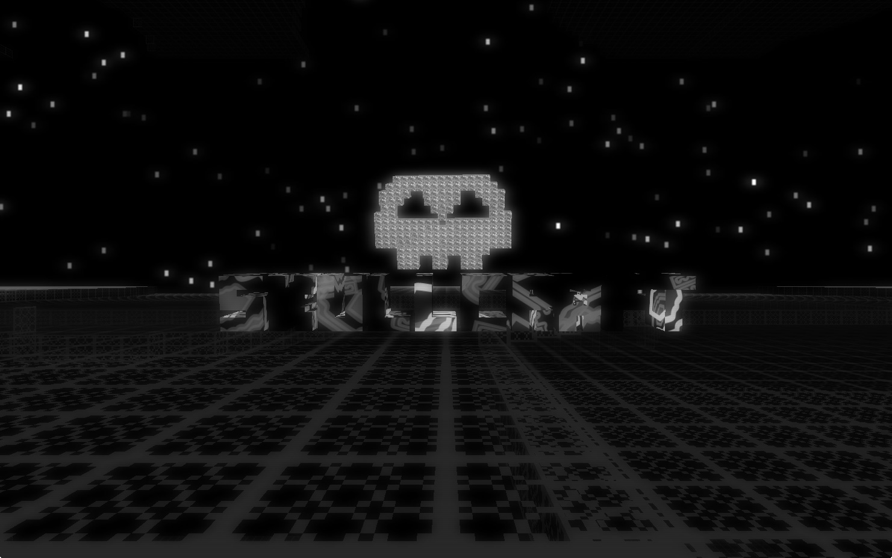
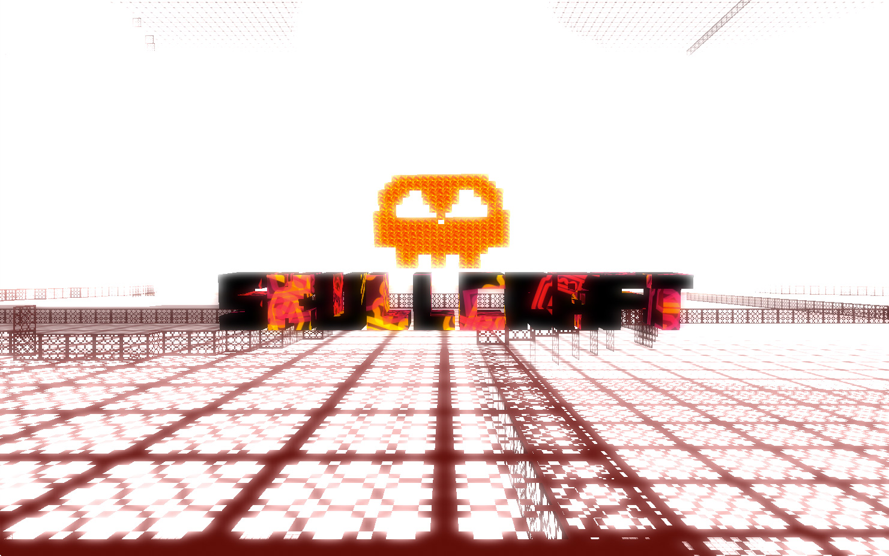

ds.skullCraftIntro
==================
<pre>
 ______     __  __     __  __     __         __         ______     ______     ______     ______   ______  
/\  ___\   /\ \/ /    /\ \/\ \   /\ \       /\ \       /\  ___\   /\  == \   /\  __ \   /\  ___\ /\__  _\ 
\ \___  \  \ \  _"-.  \ \ \_\ \  \ \ \____  \ \ \____  \ \ \____  \ \  __<   \ \  __ \  \ \  __\ \/_/\ \/ 
 \/\_____\  \ \_\ \_\  \ \_____\  \ \_____\  \ \_____\  \ \_____\  \ \_\ \_\  \ \_\ \_\  \ \_\      \ \_\ 
  \/_____/   \/_/\/_/   \/_____/   \/_____/   \/_____/   \/_____/   \/_/ /_/   \/_/\/_/   \/_/       \/_/ 
                                                                                                          
</pre>

Start up screen for a webGL game I have been creating using voxelJS, processing, and the hypeframework.  The screen uses postprocessing rendering effects like film grain, bloom pass, etc.

